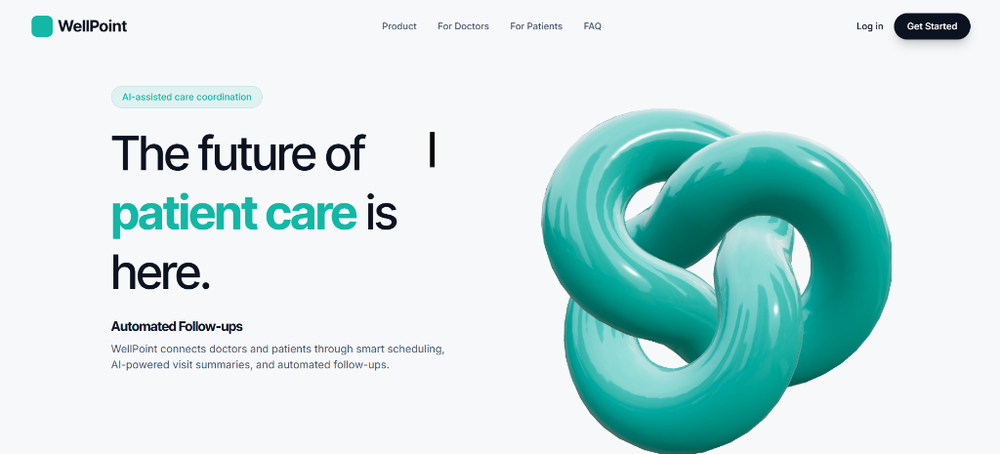

<div align="center">

# 🏥 WellPoint

**A Next-Generation Healthcare Management Platform**

[](https://reactjs.org/)
[](https://www.typescriptlang.org/)
[](https://tailwindcss.com/)
[](https://spring.io/projects/spring-boot)
[](https://supabase.com/)
[](https://groq.com/)

*WellPoint is a comprehensive, beautifully designed clinic management system that bridges the gap between patients, doctors, and administrators using modern web technologies and AI.*

[Explore Features](#sparkles-key-features) • [Installation](#gear-installation--setup) • [Architecture](#triangular_ruler-architecture) • [Screenshots](#camera-gallery)



</div>

---

## 🌟 Vision

WellPoint was designed with a **"classy, clinical-modern, and calm"** aesthetic. The goal is to provide a trustworthy, dynamic, and frictionless experience for healthcare professionals and patients alike. By integrating Groq AI and Google Calendar, WellPoint reduces administrative overhead, allowing doctors to focus entirely on patient care.

---

## :sparkles: Key Features

### 👨‍⚕️ For Doctors
- **Smart Dashboard:** A beautifully animated, Framer Motion-powered dashboard to view daily schedules at a glance.
- **AI Post-Visit Notes:** Leverage Groq AI to automatically generate, summarize, and format patient visit notes and prescriptions.
- **Google Calendar Sync:** Two-way synchronization with Google Calendar so doctors never miss an appointment.
- **Leave Management:** Mark unavailability to automatically block booking slots for patients.
- **Security:** Self-service password management for accounts generated by admins.

### 🤒 For Patients
- **Frictionless Booking:** Search for doctors by specialization, view real-time availability, and book appointments instantly.
- **Appointment History:** Track upcoming and past visits, and securely view doctor's notes and prescriptions.
- **Dynamic UI:** Smooth, responsive interfaces with micro-animations that make navigation a breeze.

### 🛡️ For Administrators
- **Staff Management:** Create, update, and manage doctor profiles and system access.
- **System Monitoring:** Monitor automated AI summaries and email notification logs in real-time.
- **Leave Approvals:** Oversee and manage doctor schedules and clinic capacity.

---

## :camera: Gallery

<div align="center">

| Patient Dashboard | Doctor Appointments |
| :---: | :---: |
|  |  |

| AI Post-Visit Notes | Admin Portal |
| :---: | :---: |
|  |  |

*(Replace the remaining `docs/screenshots/...` placeholders with the actual paths to your other screenshot files!)*

</div>

---

## :triangular_ruler: Architecture & Tech Stack

### Frontend
- **Framework:** React 18 with TypeScript, powered by Vite for blazing-fast HMR.
- **Styling:** Tailwind CSS with a curated, clinical-modern color palette (Slate, Teal, Indigo).
- **Animations:** Framer Motion for smooth route transitions and card stagger effects.
- **Data Fetching:** TanStack React Query for caching, optimistic updates, and API state management.
- **Routing:** React Router v6 with protected, role-based layout wrappers.

### Backend
- **Framework:** Spring Boot 3.3.2 (Java 23).
- **Database:** PostgreSQL (hosted on Supabase) managed with Flyway migrations.
- **Security:** Spring Security with stateless JWT (JSON Web Tokens) authentication.
- **Integrations:** 
  - **Groq API** for LLM-powered clinical note generation.
  - **Google Calendar API** via OAuth2 for appointment synchronization.

---

## 🗄️ Database Schema Overview

WellPoint relies on a highly normalized PostgreSQL database structure enforcing strong integrity constraints.

1. **Users & Auth:** `users` table handles Patients, Doctors, and Admins.
2. **Medical Entities:** `doctors`, `patients`, `specialisations`.
3. **Scheduling Core:** 
   - `appointments`: Tracks `PENDING`, `CONFIRMED`, `CANCELLED` states. Enforces a `UNIQUE(doctor_id, slot_time)` constraint to prevent double-booking at the database level.
   - `slot_holds`: Manages temporary 10-minute holds while patients fill out forms.
   - `doctor_leave_days`: Allows admins to mark dates as unavailable, which automatically triggers cancellation of existing appointments.
4. **Asynchronous Processing Logs:** `email_logs`, `pre_visit_summaries`, `post_visit_notes` (used for background retries and Admin portal monitoring).

---

## 🤖 LLM Prompts & AI Integration

WellPoint utilizes **Groq AI** for medical summarization. The backend orchestrates these prompts asynchronously.

### Post-Visit Notes Generation
When a doctor completes a visit, they input raw, shorthand medical observations. The system securely sends these to the LLM with a highly structured prompt to generate professional, formatted notes:

```text
You are a professional medical assistant. 
Take the following raw shorthand notes from a doctor and format them into a clean, professional post-visit clinical summary. 
Structure the response with the following sections if applicable:
- Chief Complaint
- Observations
- Diagnosis
- Treatment Plan / Prescriptions
- Follow-up Instructions

Ensure the tone is objective and clinical.
Raw notes: {doctor_input}
```

*Note: The LLM processes are designed to be fault-tolerant. If the API fails or rate-limits, the record is marked `FAILED` in the database, and a `@Scheduled` job will retry it automatically up to 3 times.*

---

## 📅 Google Calendar Setup

Doctors can opt-in to sync their WellPoint appointments with their personal Google Calendar. 

### Setting up the OAuth Application
1. Go to the [Google Cloud Console](https://console.cloud.google.com/).
2. Create a new project and enable the **Google Calendar API**.
3. Navigate to **APIs & Services > Credentials** and create an **OAuth 2.0 Client ID**.
4. Set the Application Type to **Web application**.
5. Add your backend URL to the **Authorized redirect URIs** (e.g., `http://localhost:8080/api/v1/calendar/callback` for local development).
6. Copy the **Client ID** and **Client Secret** into your `.env` file (see Configuration).

*WellPoint uses AES-256 encryption to securely store the refresh tokens returned by Google in the database.*

---

## 🔌 API Documentation

WellPoint provides a robust REST API. Once the backend is running, the Swagger UI is automatically generated and accessible.

- **Swagger UI / OpenAPI Spec:** `http://localhost:8080/swagger-ui.html`

### Key Endpoints
- `POST /api/v1/auth/login` - Authenticate and receive a JWT.
- `GET /api/v1/doctors` - Publicly accessible list of active doctors with pagination.
- `POST /api/v1/appointments/hold` - Create a temporary lock on a time slot (10 mins).
- `POST /api/v1/appointments/confirm` - Finalize a held appointment.
- `POST /api/v1/admin/doctors/{id}/leave` - Mark a doctor on leave and automatically cancel conflicting appointments.

---

## :gear: Installation & Setup

### Prerequisites
- Node.js (v18+)
- Java 23 (JDK)
- Maven
- PostgreSQL (or a Supabase account)

### 1. Clone the Repository
```bash
git clone https://github.com/yourusername/WellPoint.git
cd WellPoint
```

### 2. Configuration (`.env`)
Create a `.env` file in the root directory. You can use the `.env.example` as a template:

```env
# Database Configuration
DB_URL=jdbc:postgresql://your-supabase-db.pooler.supabase.com:5432/postgres
DB_USERNAME=postgres
DB_PASSWORD=your_secure_password

# Authentication
JWT_SECRET=your_long_random_jwt_secret_key_here
JWT_EXPIRY_MS=900000
JWT_REFRESH_EXPIRY_MS=604800000

# LLM Configuration (Groq)
LLM_PROVIDER=openai
LLM_API_KEY=your_api_key_here
LLM_MODEL=gpt-4o-mini
LLM_BASE_URL=https://api.openai.com/v1

# Email Configuration (SendGrid)
EMAIL_PROVIDER=sendgrid
SENDGRID_API_KEY=SG.your_sendgrid_key_here
EMAIL_FROM=noreply@yourdomain.com
EMAIL_FROM_NAME=WellPoint Healthcare

# Google Calendar Integration
GOOGLE_CLIENT_ID=your_client_id.apps.googleusercontent.com
GOOGLE_CLIENT_SECRET=your_client_secret
GOOGLE_REDIRECT_URI=http://localhost:8080/api/v1/calendar/callback
CALENDAR_ENCRYPTION_KEY=your_32_byte_aes_encryption_key

# Frontend Link
FRONTEND_URL=http://localhost:5173
```

### 3. Backend Setup
1. Open the root directory.
2. Run the Spring Boot server (it will automatically execute Flyway migrations on your empty database):
   ```bash
   mvn clean spring-boot:run
   ```
   *The backend will start on `http://localhost:8080`.*

### 4. Frontend Setup
1. Navigate to the frontend directory:
   ```bash
   cd healthcare-frontend
   ```
2. Install dependencies:
   ```bash
   npm install
   ```
3. Start the Vite development server:
   ```bash
   npm run dev
   ```
   *The frontend will start on `http://localhost:5173`.*

---

## :lock: Default Credentials (Dev Environment)

When the backend starts for the first time, an Admin Seeder script automatically creates the default administrator account.

| Role | Email | Password |
| :--- | :--- | :--- |
| **Admin** | `tekadet10@gmail.com` | `admin@123` |
| **Doctor** | *(Created via Admin Portal)* | *(Auto-generated & shown on creation)* |
| **Patient** | *(Self-registration)* | *(Self-registration)* |

---

<div align="center">
  <p>Built with ❤️ by TejaS12112004.</p>
</div>