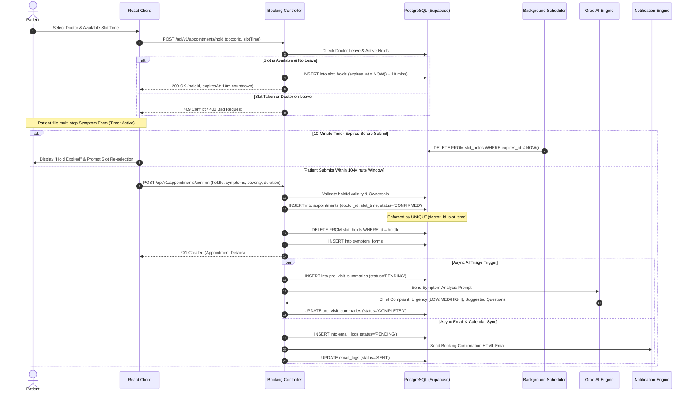
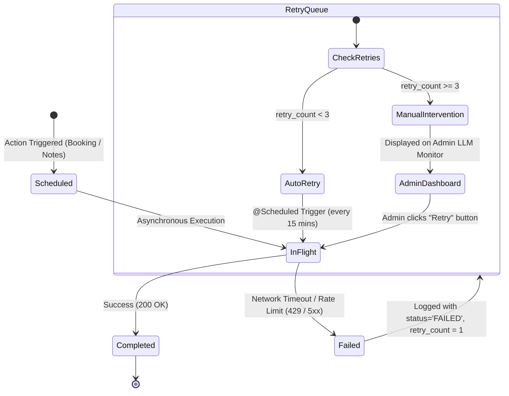
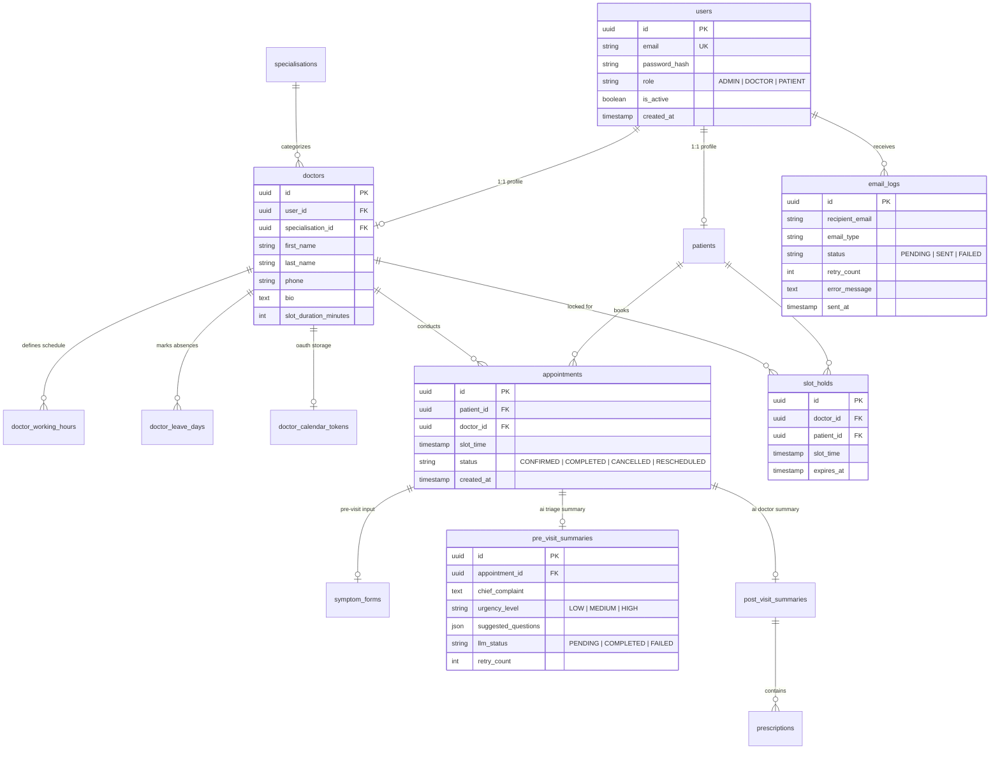
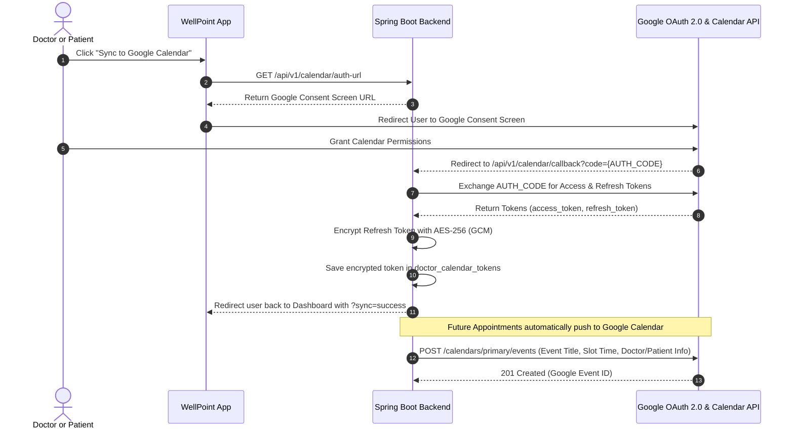

<div align="center">

# 🏥 WellPoint — AI-Assisted Clinical Care & Appointment Management Platform

**An enterprise-grade, full-stack healthcare coordination platform with Groq LLM intelligence, Google Calendar synchronization, and robust concurrency-safe appointment scheduling.**

[](https://wellpoint-healthcare-project-kgqv-eight.vercel.app)
[](https://render.com)
[](https://reactjs.org/)
[](https://supabase.com/)
[](https://groq.com/)
[](LICENSE)

*Built with a "classy, clinical-modern, and calm" design language, delivering seamless doctor-patient care coordination, real-time slot locking, automated triage, and resilient asynchronous notification workflows.*

🔗 **Live Frontend URL:** [https://wellpoint-healthcare-project-kgqv-eight.vercel.app](https://wellpoint-healthcare-project-kgqv-eight.vercel.app)

[Architecture & Pipelines](#-system-architecture--pipelines) • [Concurrency & Slot Hold](#-concurrency--conflict-resolution-system-design) • [Database Schema](#-database-schema--entity-relationships) • [API Reference](#-api-documentation) • [LLM Prompts](#-llm-prompts--ai-intelligence) • [Google Calendar](#-google-calendar-integration) • [Local Setup](#-installation--setup-guide)

---

</div>

## 📑 Table of Contents
1. [System Architecture & Pipelines](#-system-architecture--pipelines)
   - [High-Level System Topology](#1-high-level-system-topology)
   - [Appointment Booking & Slot Hold Pipeline](#2-appointment-booking--slot-hold-pipeline)
   - [Doctor Leave Management & Conflict Resolution](#3-doctor-leave-management--conflict-resolution-pipeline)
   - [AI Summarization & Notification Resilience Pipeline](#4-ai-summarization--notification-resilience-pipeline)
2. [Concurrency & Conflict Resolution (System Design)](#-concurrency--conflict-resolution-system-design)
3. [Database Schema & Entity Relationships](#-database-schema--entity-relationships)
4. [API Documentation & Endpoints](#-api-documentation)
5. [LLM Prompts & AI Intelligence](#-llm-prompts--ai-intelligence)
6. [Google Calendar Integration](#-google-calendar-integration)
7. [UI Design System & Aesthetics](#-ui-design-system--canonical-tokens)
8. [Installation & Setup Guide](#-installation--setup-guide)
9. [Environment Variables Reference](#-environment-variables-reference)
10. [Default Credentials](#-default-credentials)

---

## 🏛️ System Architecture & Pipelines

### 1. High-Level System Topology

```mermaid
flowchart TB
    subgraph Clients["Clients & Edge Tier"]
        Browser["Desktop & Mobile Browsers"]
        VercelEdge["Vercel Global Edge CDN<br/>(React 18 + Vite SPA)"]
    end

    subgraph BackendTier["Application Backend Tier (Render / Docker)"]
        Gateway["Spring Boot Security & Filter Chain<br/>(Stateless JWT Auth)"]
        Controllers["REST Controllers<br/>(Auth, Patient, Doctor, Admin, Calendar)"]
        Services["Domain Services & Transactions<br/>(@Transactional / Spring AOP)"]
        Schedulers["Background Schedulers<br/>(@Scheduled Tasks)"]
    end

    subgraph Persistence["Persistence Tier (Supabase)"]
        Postgres[("PostgreSQL 15+<br/>(healthcare_dev schema)") ]
        Flyway["Flyway Migration Engine<br/>(V1 to V7 Migrations)"]
    end

    subgraph ExternalServices["External APIs & Services"]
        Groq["Groq Cloud API<br/>(Llama-3-8B-8192 Fast Inference)"]
        GCalendar["Google Calendar API v3<br/>(OAuth 2.0 Two-Way Sync)"]
        Gmail["Gmail SMTP Server<br/>(TLS Port 587 Notification Engine)"]
    end

    Browser -->|HTTPS / WSS| VercelEdge
    VercelEdge -->|REST API Requests with Bearer JWT| Gateway
    Gateway --> Controllers
    Controllers --> Services
    Services -->|HikariCP Connection Pool| Postgres
    Flyway -.->|Schema Versioning| Postgres
    Schedulers -->|Hold Expiration & Job Retries| Services
    Services -->|Async HTTP / WebClient| Groq
    Services -->|Async HTTP / OAuth2| GCalendar
    Services -->|JavaMailSender / TLS| Gmail
```

---

### 2. Appointment Booking & Slot Hold Pipeline

The appointment pipeline guarantees that race conditions cannot lead to double bookings, even under heavy concurrent traffic.



---

### 3. Doctor Leave Management & Conflict Resolution Pipeline

When an administrator schedules a doctor leave, the system executes an atomic cascade cancellation of conflicting appointments and notifies all impacted patients without blocking the administrator's UI.

```mermaid
flowchart TD
    A([Admin Marks Doctor Leave Day]) --> B[POST /api/v1/admin/doctors/{id}/leave]
    B --> C[Validate: No Existing Leave for Date]
    C --> D[Insert record into doctor_leave_days]
    D --> E[Query appointments for Doctor & Date WHERE status in 'PENDING', 'CONFIRMED']
    
    E --> F{Any Conflicting Appointments Found?}
    F -- No Conflicts --> G[Return 200 OK with affectedCount = 0]
    
    F -- Conflicts Found --> H[Atomic Status Update: Set status = 'CANCELLED']
    H --> I[Queue Cancellation Emails in email_logs table]
    I --> J[Return 200 OK + List of Cancelled Patients to Admin Modal]
    
    J --> K[Async Background Email Sender Sweeps Queue]
    K --> L[Dispatch Personalized Cancellation & Reschedule Email via SMTP]
    L --> M[Update email_logs: status = 'SENT']
```

---

### 4. AI Summarization & Notification Resilience Pipeline

External APIs (LLMs, Google Calendar, SMTP) may encounter transient failures. The system guarantees **eventual consistency** through scheduled retries and manual administrative oversight.



---

## 🛡️ Concurrency & Conflict Resolution (System Design)

### 1. Double-Booking Prevention (Two-Layer Defense)
* **Application Layer:** Before issuing a slot or confirming an appointment, the service checks active appointments, doctor working schedules, leave days, and unexpired slot holds.
* **Database Layer:** The PostgreSQL database enforces a strict composite constraint:
  ```sql
  CONSTRAINT uq_doctor_slot UNIQUE (doctor_id, slot_time)
  ```
  If concurrent transactions attempt to book the same slot, PostgreSQL serializes the commit; the second transaction throws a `ConstraintViolationException` which the Global `@RestControllerAdvice` translates into an immediate `409 Conflict`.

### 2. Slot Hold Mechanism (10-Minute Lock)
* Prevents slot sniping while patients fill out clinical symptom forms.
* `slot_holds` table stores `hold_id`, `doctor_id`, `patient_id`, `slot_time`, and `expires_at`.
* A Spring `@Scheduled` daemon job cleans expired holds every 60 seconds.

### 3. Asynchronous Non-Blocking Execution
* Google Calendar synchronization and Groq LLM generations run on dedicated thread pools. If Google Calendar OAuth fails or Groq is rate-limited, the core user transaction is **never rolled back**.

---

## 🗄️ Database Schema & Entity Relationships

The PostgreSQL database is organized into the `healthcare_dev` schema and versioned via **Flyway Database Migrations (`V1__...` to `V7__...`)**.



---

## 🔌 API Documentation

The backend exposes fully documented RESTful APIs with Swagger UI available at `/swagger-ui.html`.

### Authentication & Password Management
| Method | Endpoint | Description | Auth |
|---|---|---|---|
| `POST` | `/api/v1/auth/register` | Self-register as a new patient | Public |
| `POST` | `/api/v1/auth/login` | Authenticate & receive JWT access + refresh tokens | Public |
| `POST` | `/api/v1/auth/refresh` | Exchange refresh token for new access token | Public |
| `POST` | `/api/v1/auth/change-password` | Update password (used for temp-to-permanent password) | Authenticated |

### Patient Scheduling & Care
| Method | Endpoint | Description | Auth |
|---|---|---|---|
| `GET` | `/api/v1/doctors` | Search active doctors by specialization / date | Public / Patient |
| `GET` | `/api/v1/doctors/{id}/slots` | Fetch real-time available time slots for a date | Patient |
| `POST` | `/api/v1/appointments/hold` | Place a 10-minute temporary lock on a slot | Patient |
| `POST` | `/api/v1/appointments/confirm` | Confirm booking with symptom assessment form | Patient |
| `GET` | `/api/v1/patient/appointments` | List patient's upcoming, past, and cancelled visits | Patient |
| `GET` | `/api/v1/patient/appointments/{id}` | Get appointment detail, AI summaries & prescriptions | Patient |
| `POST` | `/api/v1/patient/appointments/{id}/cancel` | Cancel an upcoming confirmed appointment | Patient |

### Doctor Portal
| Method | Endpoint | Description | Auth |
|---|---|---|---|
| `GET` | `/api/v1/doctor/dashboard` | Daily metrics, patient queue, and upcoming appointments | Doctor |
| `GET` | `/api/v1/doctor/appointments` | Filterable list of all doctor's patient consultations | Doctor |
| `GET` | `/api/v1/doctor/appointments/{id}` | Clinical view with AI pre-visit triage summary | Doctor |
| `POST` | `/api/v1/doctor/appointments/{id}/notes` | Submit clinical notes & prescriptions; trigger AI post-visit summary | Doctor |

### Admin Portal & Resilience
| Method | Endpoint | Description | Auth |
|---|---|---|---|
| `GET` | `/api/v1/admin/doctors` | List all doctors with status, schedule & slot metrics | Admin |
| `POST` | `/api/v1/admin/doctors` | Create doctor account with auto-generated temporary password | Admin |
| `PUT` | `/api/v1/admin/doctors/{id}` | Update doctor profile, working hours & slot duration | Admin |
| `PATCH` | `/api/v1/admin/doctors/{id}/status` | Activate or deactivate doctor access | Admin |
| `GET` | `/api/v1/admin/doctors/{id}/leave` | View doctor's monthly leave schedule | Admin |
| `POST` | `/api/v1/admin/doctors/{id}/leave` | Mark doctor leave & trigger atomic patient cancellations | Admin |
| `DELETE` | `/api/v1/admin/doctors/{id}/leave` | Remove scheduled leave for a date | Admin |
| `GET` | `/api/v1/admin/notifications` | View email delivery logs with status & retry counters | Admin |
| `POST` | `/api/v1/admin/notifications/retry` | Trigger batch retry for all failed notifications | Admin |
| `GET` | `/api/v1/admin/llm-monitor` | Real-time monitoring of failed AI summaries | Admin |
| `POST` | `/api/v1/admin/llm-monitor/retry` | Manually retry a specific failed LLM summary | Admin |

### Google Calendar OAuth2
| Method | Endpoint | Description | Auth |
|---|---|---|---|
| `GET` | `/api/v1/calendar/auth-url` | Generate Google OAuth2 authorization consent URL | Doctor / Patient |
| `GET` | `/api/v1/calendar/callback` | OAuth2 callback code exchange & token storage | Doctor / Patient |

---

## 🤖 LLM Prompts & AI Intelligence

WellPoint leverages **Groq Cloud** with high-throughput Llama-3 inference. The prompts are strictly typed and parsed into JSON.

### 1. Pre-Visit Patient Symptom Analysis
Executed asynchronously upon appointment confirmation to provide doctors with instant clinical context before entering the consultation room:

```text
System: You are an expert clinical triage assistant. Analyze patient reported symptoms and return ONLY a valid JSON object matching the requested schema.

User:
Patient Age/Context: Adult
Symptoms: "{patient_symptoms}"
Reported Duration: {duration_days} days
Patient Severity Assessment: {severity}/10
Additional Notes: "{additional_notes}"

Respond strictly with this JSON structure:
{
  "chiefComplaint": "Concise 1-sentence medical summary of primary issue",
  "urgencyLevel": "LOW | MEDIUM | HIGH",
  "suggestedQuestions": [
    "Targeted diagnostic question 1",
    "Targeted diagnostic question 2",
    "Targeted diagnostic question 3"
  ]
}
```

### 2. Post-Visit Clinical Documentation & Patient Summary
Executed after doctor submits raw shorthand clinical observations:

```text
System: You are a medical documentation specialist. Convert shorthand doctor notes into both a professional medical record and an empathetic, easy-to-understand patient takeaway.

User:
Doctor Shorthand Notes: "{raw_doctor_notes}"
Prescribed Medications: {prescriptions_json}

Respond strictly with this JSON structure:
{
  "clinicalSummary": "Professional medical record formatted with Observations, Assessment, and Plan",
  "patientFriendlySummary": "Clear, empathetic explanation in plain language explaining the diagnosis and what the patient should do",
  "followUpAdvice": "Clear lifestyle, dietary, or warning signs requiring immediate emergency care"
}
```

---

## 📅 Google Calendar Integration



---

## 🎨 UI Design System & Canonical Tokens

The frontend adheres to a strict design system defined in `src/styles/tokens.css` consuming custom CSS design tokens:

| Token Name | CSS Variable | Hex / Value | Usage |
|---|---|---|---|
| **Ink (Text Primary)** | `--color-ink` | `#0f172a` (Slate 900) | Primary typography, headers, dark elements |
| **Ink Secondary** | `--color-ink / 60` | `rgba(15, 23, 42, 0.6)` | Subtitles, helper text, table meta |
| **Background** | `--color-bg` | `#f8fafc` (Slate 50) | Main page background |
| **Surface** | `--color-surface` | `#ffffff` | Elevated cards, modals, interactive panels |
| **Accent Primary** | `--color-accent` | `#0d9488` (Teal 600) | Primary buttons, active states, branding |
| **Success** | `--color-success` | `#16a34a` (Emerald 600) | Completed statuses, badges, success toasts |
| **Danger** | `--color-danger` | `#dc2626` (Red 600) | Cancelled status, destructive actions, error alerts |
| **Warning** | `--color-warning` | `#d97706` (Amber 600) | Pending holds, medium urgency badges |
| **Display Font** | `--font-display` | `Inter Tight, sans-serif` | All section headings, card titles |
| **Body Font** | `--font-body` | `Inter, sans-serif` | Form controls, body copy, tables |
| **Radius Scale** | `--radius-lg` | `0.75rem (12px)` | Canonical card and modal border radius |

---

## ⚙️ Installation & Setup Guide

### Prerequisites
* **Java 21 or 23** (Eclipse Temurin Recommended)
* **Maven 3.9+**
* **Node.js 18+ & npm 9+**
* **PostgreSQL Database** (Supabase, Neon, or local PostgreSQL instance)
* **Groq Cloud API Key** ([Console](https://console.groq.com))
* **Google Cloud Console OAuth 2.0 Credentials**

### 1. Clone the Repository
```bash
git clone https://github.com/TejaS12112004/wellpoint_healthcare_project.git
cd wellpoint_healthcare_project
```

### 2. Configure Environment Variables
Copy `.env.example` into `.env` and fill in your credentials:
```bash
cp .env.example .env
```

### 3. Run Backend (Spring Boot)
```bash
# Clean, compile and launch Spring Boot
mvn clean spring-boot:run
```
*Backend starts on `http://localhost:8080` with Flyway auto-migrating the database schema.*

### 4. Run Frontend (React + Vite)
```bash
cd healthcare-frontend
npm install
npm run dev
```
*Frontend runs on `http://localhost:5173`.*

---

## 🔐 Environment Variables Reference

Create a `.env` file in the root directory:

```env
# ============================================================
#  DATABASE CONFIGURATION (PostgreSQL / Supabase)
# ============================================================
DB_URL=jdbc:postgresql://aws-0-ap-southeast-1.pooler.supabase.com:5432/postgres?currentSchema=healthcare_dev
DB_USER=postgres.your_project_id
DB_PASSWORD=your_database_password

# ============================================================
#  JWT SECURITY
# ============================================================
JWT_SECRET=K1PCqunWeDKIsw3EbAu4WTiR9aFY7wbjBTuYotxKE9s=
JWT_EXPIRY_MS=900000
JWT_REFRESH_EXPIRY_MS=604800000

# ============================================================
#  LLM CONFIGURATION (Groq Cloud API)
# ============================================================
LLM_PROVIDER=openai
LLM_API_KEY=gsk_your_groq_api_key_here
LLM_BASE_URL=https://api.groq.com/openai/v1
LLM_MODEL=llama3-8b-8192

# ============================================================
#  GOOGLE CALENDAR OAUTH 2.0
# ============================================================
GOOGLE_CLIENT_ID=your_google_client_id.apps.googleusercontent.com
GOOGLE_CLIENT_SECRET=GOCSPX-your_google_client_secret
GOOGLE_REDIRECT_URI=http://localhost:8080/api/calendar/callback
CALENDAR_ENCRYPTION_KEY=N0P1Q2R3S4T5U6V7W8X9Y0Z1A2B3C4D5E6F7G8H9I0J=

# ============================================================
#  EMAIL NOTIFICATIONS (Gmail SMTP)
# ============================================================
MAIL_HOST=smtp.gmail.com
MAIL_PORT=587
MAIL_USERNAME=your_gmail@gmail.com
MAIL_PASSWORD=your_gmail_app_password

# ============================================================
#  FRONTEND URL
# ============================================================
FRONTEND_URL=http://localhost:5173
```

---

## 🔑 Default Credentials

The database automatically seeds an initial administrator upon first launch:

| Role | Email | Password | Permissions |
|---|---|---|---|
| **Admin** | `tekadet10@gmail.com` | `admin@123` | Doctor management, Leave scheduling, System & LLM logs, Notifications |
| **Doctor** | *(Created via Admin Portal)* | *(Temporary password generated on creation, self-updateable)* | Consultation dashboard, Patient queue, AI Post-visit clinical notes |
| **Patient** | *(Self-registration via `/register`)* | *(Set by user)* | Doctor search, Real-time slot locking, Appointment history, Summaries |

---

## 📄 License
This project is licensed under the MIT License — see the [LICENSE](LICENSE) file for details.

---

<div align="center">
  <p>Built with ❤️ by TejaS12112004.</p>
</div>